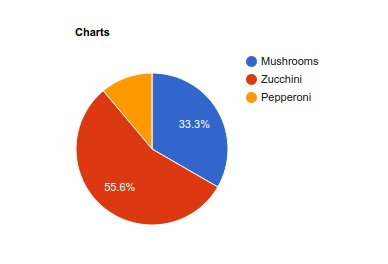

# Morfy Charts Plugin
Morfy Google Charts plugin.

Code:  
```
{chart data="Mushrooms,3|Zucchini,5|Pepperoni,1"}
```

Result:  


Code:  
```
{chart width="640" height="480" data="Mushrooms,3|Zucchini,5|Pepperoni,1"}
```

Result:  


Code:  
```
{chart width="640" height="480" title="How Much Pizza I Ate Last Night" data="Mushrooms,3|Zucchini,5|Pepperoni,1"}
```

Result:  


Code:  
```
{chart width="640" height="480" title="How Much Pizza I Ate Last Night" type="bar" data="Mushrooms,3|Zucchini,5|Pepperoni,1"}
```

Result:  


## License
See [LICENSE](https://github.com/morfy-cms/morfy-plugin-charts/blob/master/LICENSE)
